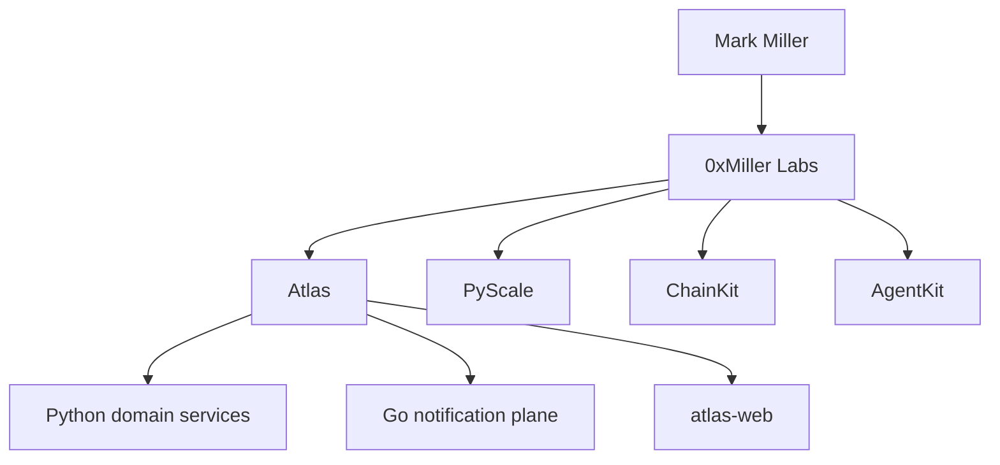

  
   
  <strong>Python</strong> · <strong>Go</strong> · <strong>FastAPI</strong> · <strong>PostgreSQL</strong> · <strong>Kafka</strong> · <strong>Kubernetes</strong> · <strong>EVM</strong>
    
  <a href="https://0xmmiller.github.io">site</a>
  ·
  <a href="https://github.com/0xmmiller/architecture">architecture</a>
  ·
  <a href="https://github.com/0xmmiller/architecture/blob/main/adr/003-idempotency.md">ADR-003</a>
  ·
  <a href="https://github.com/0xmmiller/architecture/blob/main/adr/007-go-notification-plane.md">ADR-007</a>

---

**Currently building**

| | | |
| --- | --- | --- |
| **Atlas** | Digital asset operations platform | [arch](https://github.com/0xmmiller/architecture) · [web](https://github.com/0xmmiller/atlas-web) · [notify (Go)](https://github.com/0xmmiller/notification-service) |
| **PyScale** | Backend performance lab — p50/p95/p99, not folklore | [repo](https://github.com/0xmmiller/pyscale) |
| **ChainKit** | Reorgs, RPC failover, log splitters for indexer authors | [repo](https://github.com/0xmmiller/chainkit) |
| **AgentKit** | Durable agent runs, typed tools, retries, sandbox | [repo](https://github.com/0xmmiller/agentkit) |

Atlas is polyglot on purpose: Python owns intents and read models; Go owns SSE/webhook fan-out. That split is [ADR-007](https://github.com/0xmmiller/architecture/blob/main/adr/007-go-notification-plane.md), not a language parade.

**0xMiller Labs is a personal engineering lab, not an employer.**
