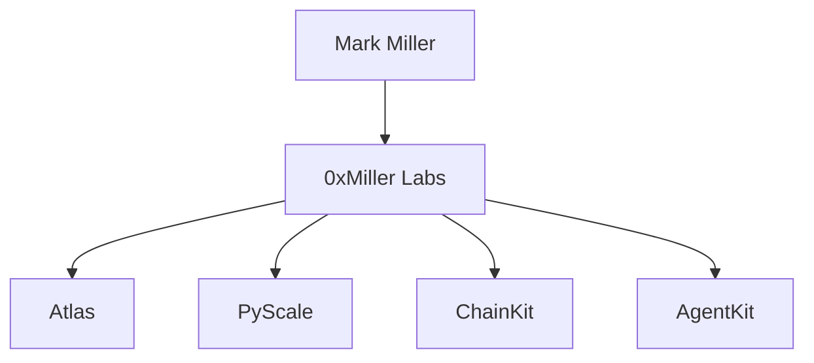

# Mark Miller

**Senior Backend Engineer**

Building distributed systems, Web3 infrastructure and developer tools.

`Python` `FastAPI` `PostgreSQL` `Kafka` `Redis` `Kubernetes` `EVM` `Solidity`

## Currently building

- **[Atlas](https://github.com/0xmmiller/architecture)** — distributed digital asset operations platform
- **[PyScale](https://github.com/0xmmiller/pyscale)** — Python backend performance lab
- **[ChainKit](https://github.com/0xmmiller/chainkit)** — Web3 infrastructure toolkit
- **[AgentKit](https://github.com/0xmmiller/agentkit)** — production-shaped agent backend

[Site](https://0xmmiller.github.io) · [ADR-003 idempotency](https://github.com/0xmmiller/architecture/blob/main/adr/003-idempotency.md) · [ADR-006 reorgs](https://github.com/0xmmiller/architecture/blob/main/adr/006-reorg-handling.md) · [Failure scenarios](https://github.com/0xmmiller/architecture/blob/main/docs/failure-scenarios.md)

**0xMiller Labs is a personal engineering lab, not an employer.**
