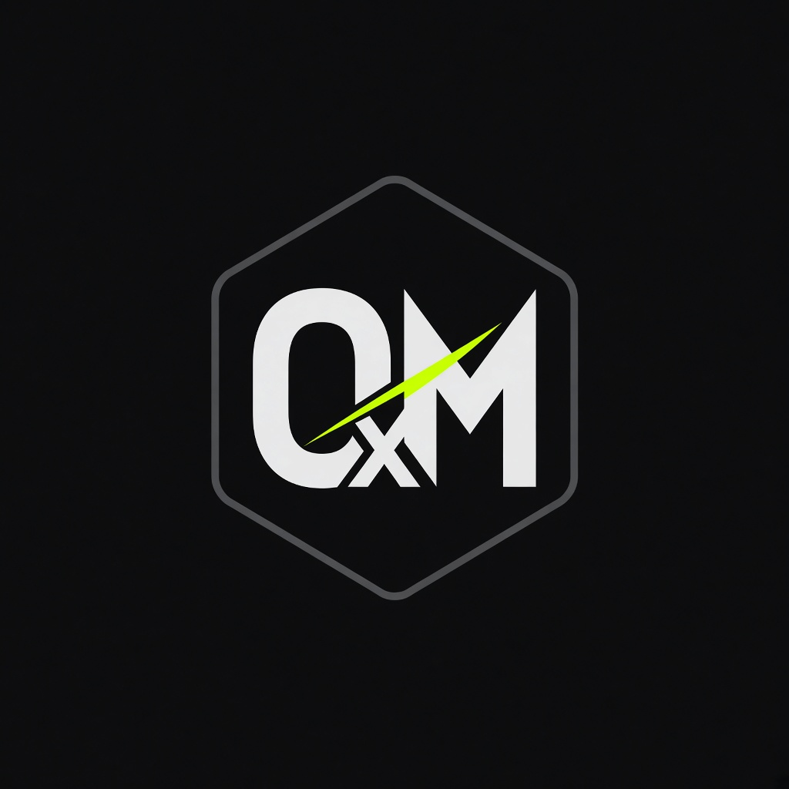

  
  <h3>Mark Miller</h3>
  
Backend engineer &amp; AI developer · RAG · local models · distributed systems · Web3

  
<strong>Python</strong> · <strong>Go</strong> · <strong>Ollama / vLLM</strong> · <strong>FastAPI</strong> · <strong>Kafka</strong> · <strong>EVM</strong>

  

    <a href="https://0xmmiller.github.io">portfolio</a> ·
    <a href="https://github.com/0xmmiller/architecture">architecture</a> ·
    <a href="https://github.com/0xmmiller/ragkit">ragkit</a> ·
    <a href="https://github.com/0xmmiller/agentkit">agentkit</a>
  

**Available for contract.** Backend, RAG/agent runtimes, EVM off-chain. Open an issue on [architecture](https://github.com/0xmmiller/architecture/issues) with label `contract`.

| | | |
| --- | --- | --- |
| **Atlas** | Asset operations platform (Python + Go notify + UI + agents) | [arch](https://github.com/0xmmiller/architecture) · [web](https://github.com/0xmmiller/atlas-web) |
| **AgentKit + RagKit** | Local models, MCP tools, retrieval with citations | [agentkit](https://github.com/0xmmiller/agentkit) · [ragkit](https://github.com/0xmmiller/ragkit) |
| **ChainKit** | Reorgs, RPC failover, log splitters | [repo](https://github.com/0xmmiller/chainkit) |
| **PyScale** | p50/p95/p99, not folklore | [repo](https://github.com/0xmmiller/pyscale) |

Personal engineering lab — not an employer, not a studio brand.
