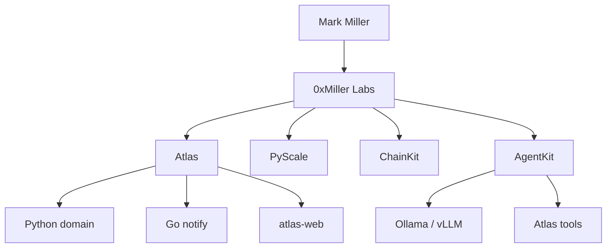

  
  <h3>Mark Miller</h3>
  
Senior Backend Engineer · AI systems · Web3 infrastructure

  

    <strong>Python</strong> · <strong>Go</strong> · <strong>FastAPI</strong> ·
    <strong>Ollama / vLLM</strong> · <strong>Kafka</strong> · <strong>Kubernetes</strong> ·
    <strong>EVM</strong>
  

  

    <a href="https://0xmmiller.github.io">site</a> ·
    <a href="https://github.com/0xmmiller/architecture">architecture</a> ·
    <a href="https://github.com/0xmmiller/agentkit">agentkit</a> ·
    <a href="https://github.com/0xmmiller/architecture/blob/main/adr/008-local-model-runtime.md">ADR-008</a>
  

---

**Currently building**

| | | |
| --- | --- | --- |
| **Atlas** | Digital asset operations. Python domain, Go notify, operator UI, **agent tools on local models** | [arch](https://github.com/0xmmiller/architecture) · [web](https://github.com/0xmmiller/atlas-web) · [notify](https://github.com/0xmmiller/notification-service) |
| **AgentKit** | Durable agent backend. Ollama/vLLM first, MCP-shaped tools, Atlas `get_portfolio` / `create_intent` | [repo](https://github.com/0xmmiller/agentkit) |
| **PyScale** | Backend performance lab — p50/p95/p99 | [repo](https://github.com/0xmmiller/pyscale) |
| **ChainKit** | Reorgs, RPC failover, log splitters | [repo](https://github.com/0xmmiller/chainkit) |

Agents are a **runtime behind Atlas**, not a chatbot page. Local models are the default; a vendor URL is an env var ([ADR-008](https://github.com/0xmmiller/architecture/blob/main/adr/008-local-model-runtime.md)).

**0xMiller Labs is a personal engineering lab, not an employer.**
